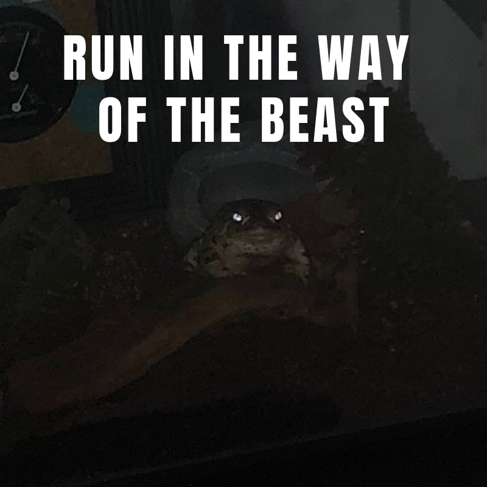

In ancient times, we did not use the term animal, but preferred the term "beast". The word carries with it a connotation that much better represents the lessons we can learn from our co-inhabitors of this world. In modern times we see vestiges of this ancient knowledge. I have heard it said that an athlete that is performing particularly well, with a particularly high degree of focus, is in a state called "beast mode".

How is it that an athlete access can such a state? One must access something deep inside of the instinct, and throw off all sense of domesticity in order to achieve "beast mode". Consider the humble toad. I keep one as a pet. Since bringing him into the home he has become domesticated, but occasionally naturally reverts back to beast mode. He does it effortlessly, almost as if it's a mistake. Normally, he is calm and docile. This is what our modern domestic life does to us today. We are so inundated with luxury and smothered with convenience built up over countless generations that we must exert great effort to tap into the beast inside.

The toad, however, can access this state at any point. He is so close to his wild roots that he forgets that humans are a good source of warmth and food. He returns to the instinct of flight. When the toad eats, he sinks deep into the natural carnivore instinct to eat anything alive, swallowing it whole. Each beast has its own beast mode and the more connected with its most basic form of subsistence in life, the less luxury and ease it has, the easier it is to access this state.

I implore you as followers of the order to learn from the toad. Cast off your luxuries, come down from the heights of Maslow's Hierarchy to which you have woefully risen by sacrificing your now lost "beast mode". Find that instinct and you will become as vicious in running as the toad is at swallowing whole its live prey.
