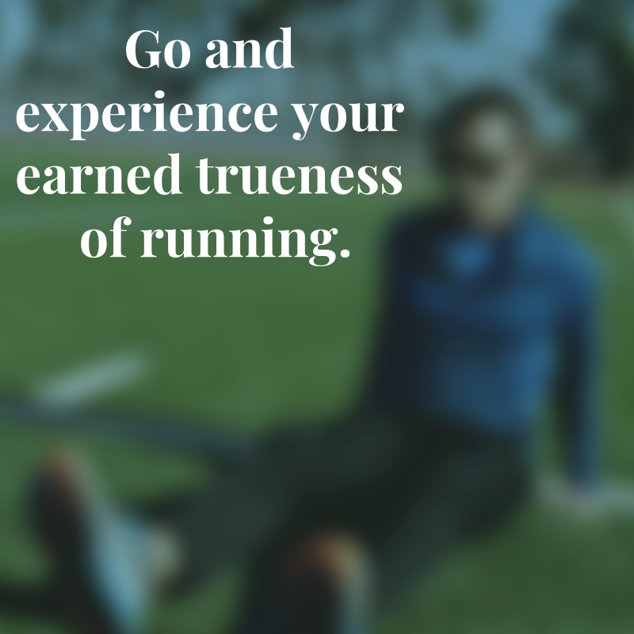

This week I achieved a major running goal for myself.  I ran 10 miles per day for seven days straight. A whole 70 miles in one week. This is 15 miles more than my previous top weekly mileage. I experienced great fatigue. I felt the effects of overtraining. It was not just hard during the course of the activity, but it put also strain on my entire life. Now it is done and I have given myself four days off. My next goal is to casually run a marathon, but seeing as it is February and I have many months to achieve this goal I am tempted to continues to rest.

We've all been there. You're training super hard, you get out there, you achieve your goal and you give yourself a rest as a reward. Once you've rested you wonder about getting back out there. Something in you just wants one more day of rest. You must run fast, but why does it have to be today?

You must recognize the insipid nature of the running culture around you. That with your achievement and your inevitable bragging on social media you have not rewarded yourself, you have actually drugged yourself. You haven't been resting, you have been in a semi-conscious high fueled by social media and braggadocio. You've been drugged and you must take yourself off of the course you have put yourself on.

No, you have not achieved some great fitness goal. You have not reached a podium of personal fitness success on which you now stand. Absolutely not. You must recognize that once you have achieved your goal, especially if you have never achieved such a high degree of fitness before, that you are now a faster runner than you have ever been in your life. Your reward is not a social media victory parade. Your reward lies in getting out there and running with a strength, power, and speed with which you've never run before. You've reached proximity with the trueness of the running experience that you have never reached before. Go experience it!

Here is my recommendation. Rest and recover. Three or four days if you must. This will give your body time to heal from any symptoms of overtraining. These include headaches, general feelings stress, strange pains or fragility in your joints, as well as catching colds or an otherwise weakened immune system. But don't revel in the rest, look forward to your first day back. When you do get back, give yourself plenty of time and plenty of distance to run. Make your body comfortable. Turn off the GPS, turn off the watch and just run. Let your body tell you what it wants to do. Let your body show you what it's capable of. Give your body control and it will show you its true speed.

After this, pick your next goal and start working on it. You trained so hard to make your body faster. Take advantage of it.
