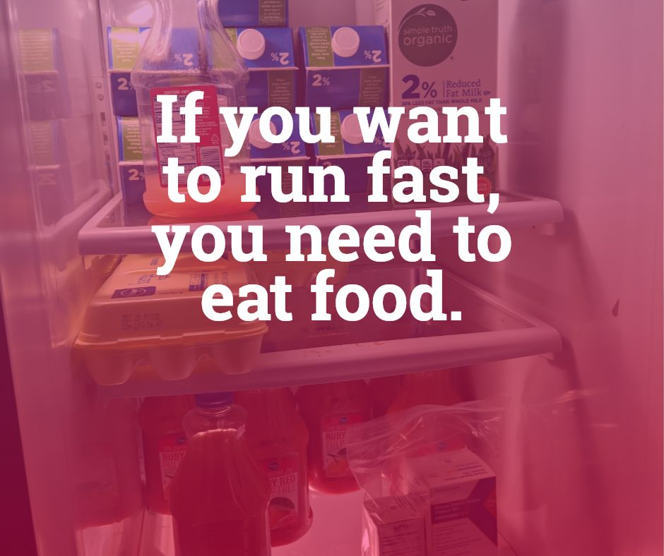

A runner must eat. If you want to run fast, you need to eat food. I have often experienced a lack of appetite after running followed by a huge appetite later on. You must know that regardless of what your stomach tells you, you must learn to force yourself to eat. Eat for nutrition, not for taste. You need fats, proteins and carbs in high quantities so make sure you're getting a balance of all three. If you're lacking fats, drink a milkshake. If you're lacking proteins, eat meat and eggs. Bacon is your super-food. Make yourself eat these things.

A runner must also successfully digest his or her food. Many people have a hard time running right after they eat. I encourage you to work at strengthening your stomach. If you must wait two hours after eating a meal to run, I encourage you to work that time down slowly. If you must limit your speed because of the meal you've eaten, work at that too. Train yourself the same way you train for running. Slowly and steadily you'll attain a stomach of iron.

You should never eliminate food through the mouth. Avoid throwing up at all costs. You need that food for energy and losing a meal or two is more trouble than it's worth.

Finally, there is the removal of waste from the body.

The proper way to eliminate waste from the body is through the rectum in the proper place at the proper time. You must learn how your body behaves in this regard to not be interrupted during your run. Defecating is not fast (although the task itself can be done quickly, it is much a much slower way to traverse distance than running). Therefore you should avoid it while you're running. Learn your body's rhythms. My body has gotten to a point where if I'm planning to run my digestive tract will prepare itself. The mere suggestion of running can really speed up the lower intestine in preparation for the run. It wasn't always this way. For many years I had to make sure I ran during the same time of the day so that my body could stay on rhythm. You can figure it out. I'm sure there is a next level beyond mine as well and I'm looking forward to achieving it (or perhaps discovering it).
