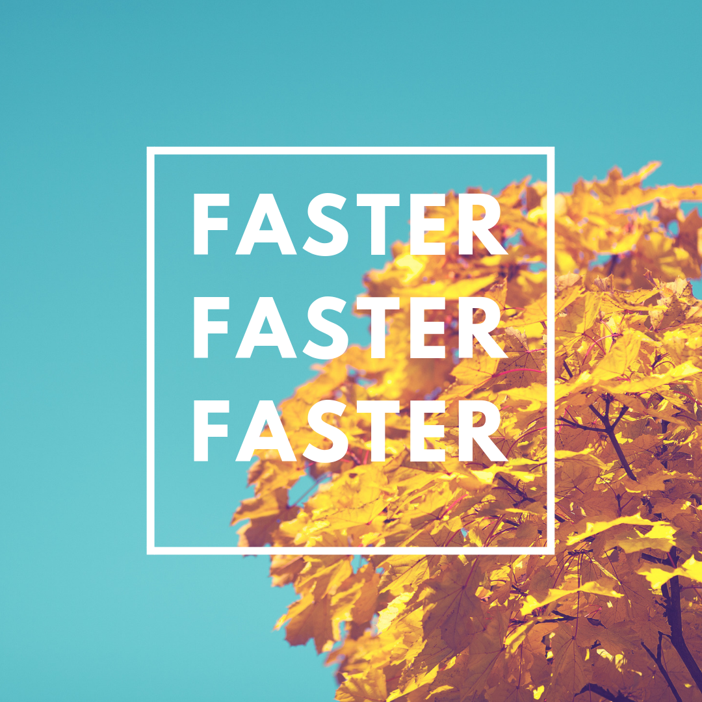

The Cambridge English Dictionary on Meditation: "the act of giving your attention to only one thing, either as a religious activity or as a way of becoming calm and relaxed"

Running is meditation. You give your attention to only one thing when you run. Some people give their attention to the music or podcast they listen to while running. Others focus on the pain. Still others distract themselves with videos on the Dreadmill. I often find myself meditating on whatever comes to mind.

Lot's of things come to mind when I'm running. If I have a problem at work, I can usually come up with a novel solution in the deep meditative state of running. If I am angry or have otherwise strong emotions, I can find relief in the calm of running. Sometimes if I don't know how I'm going to use my day, running helps me find the best thing to do. Many times I meditate on random things when I'm running. A song may pop into my head and I can't get it out the whole run. That's ok, it's allow ted to be there.

So what is really the one thing I give my attention to? Most of the time speed is my meditation of choice. I have a speed mantra. I become aware of the ground moving swiftly under my feet; or rather with my feet which are stuck to earth for brief moments at a time. I feel the lightness in my stride that comes from the forward lean. I look down at my device to check my pace and then push it lower. Faster, faster, faster. That's the mantra. It's chaotic, I let my mind do whatever it wants, but my body must run faster and my mind always comes back to speed.
