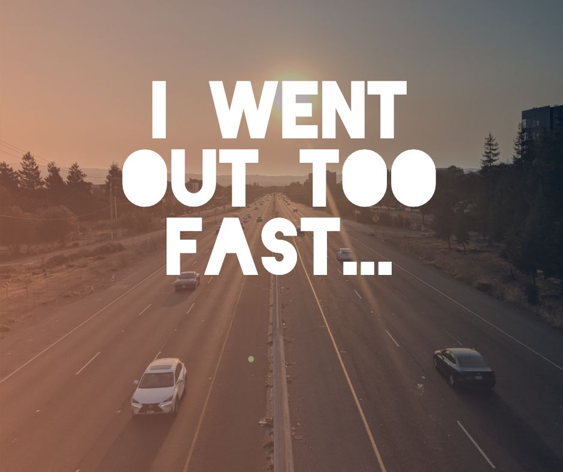

I have used a variety of racing strategies with various levels of success. I highly encourage you to race because there is nothing like somebody chasing you to make you run fast.

Some people like to actually chase somebody (commonly known as "chasing a rabbit") and they run faster that way. I prefer to be in the front and spend the entire race in sheer terror of being passed. However, there are  different kinds of races that call for different kinds of paces.

In very short races, I have found success in training myself to run my own pace and not worry at all about the field of runners around me until the very last stretch. My favorite race I ever ran was a half mile where I went from dead last in the first half of the race to winning by a full 10 meters. I had a very specific race strategy that I had practiced and perfected. I would got out very quickly and then slow way down. This baited the field into running a very fast first half of the race and left them tired while I had reserved my energy for the second half of the race. Simply running my own race, I was able to throw off the entire field and capture a tremendous victory.

In longer races I still have trouble. In the half marathon I once ran in first place for the entire race with one other runner trailing right behind me. No matter how hard I tried I couldn't shake him. In fact, he complained to me that I was running too fast to which I retorted that I wouldn't need to run so fast if he wasn't tailing me. In the end, he had a bit more left in the tank for the last mile and beat me handily. I ran my fastest half marathon that day, but I also lost.

In the marathon, which is a race I have yet to really grasp, I have had a lot of trouble. In my first I was just aiming to finish. In my second, I was feeling really good and I went out too fast. I ran the first 18 miles at a sub 3-hour pace and my body failed at 20 miles so that I could not finish the race. The event is grueling and I haven't figured out how I'm supposed to run it yet, especially as someone dedicated to running fast. My most recent marathon, I simply went back to trying to finish the race which I was able to do. I did not run fast that day. I must learn how to run fast in a marathon.
