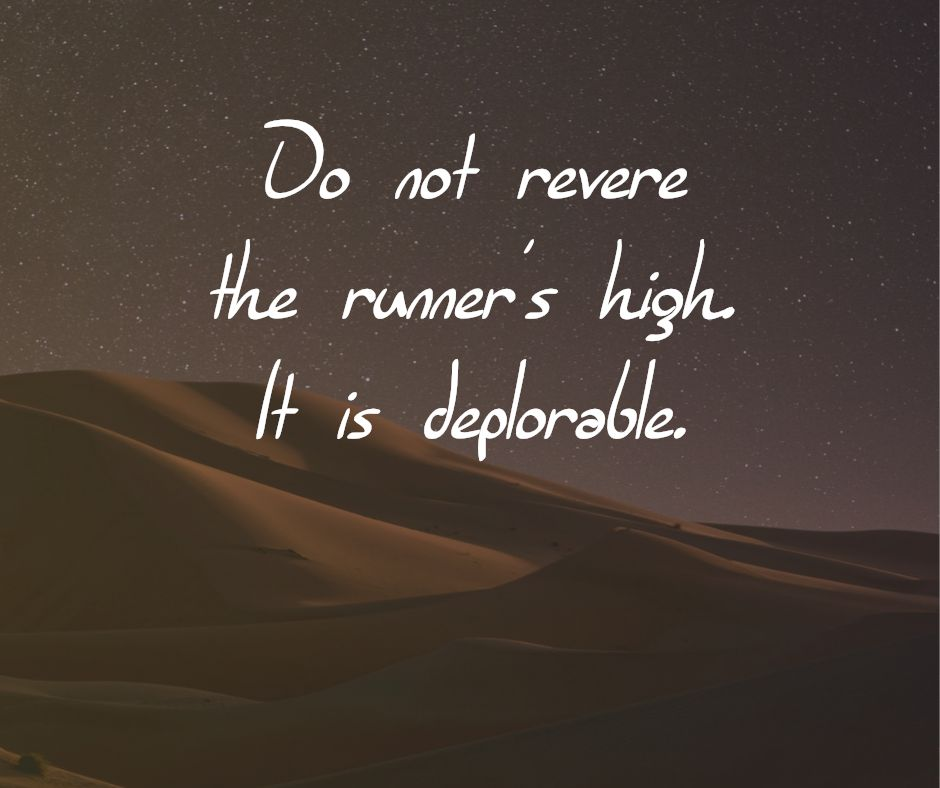

Runners high is not something that should be described. Nobody should be instructing you on how to achieve the runners high or how to intensify it. The very acknowledgement of its existence is a mere distraction from the true goal of running which is speed. The very term says it all.

When I run sometimes I feel good. Sometimes I enjoy running when it's in the 90s and I'm pouring sweat. Sometimes I enjoy a leisurely but brisk pace. This is not what people usually think of when they talk about the runners high, but it should be. It should be the focus of our conversation when we talk about the rewards of running. The runner's high is only looking to the corporeal reward of whatever hormones scientists have come up with to describe your body rewarding you or whatever the theory is. The point is that you shouldn't simply look forward to the after affects of running, but to the very act of running itself.

When you leave the office on a cold evening, tired from the day and the crisp air awakens your lungs and heart. Do you feel the urge to get out there and run? I do. Or how about when it's pouring rain on the drive home? If I'm sufficiently in tune with my running chi (qi), I relish in the opportunity to face down the elements with my speed.

If you've only experienced the after-glow high from running, you're not nearly deep enough. You need more running, you need more speed. You have much to learn.

Frankly, the runner's high is mostly useless. You get relaxed, too relaxed. You lose motivation, drive, energy and in return you receive only pleasure. No wonder it's called a "high". You might as well use drugs or herbs if that's what you're running for. It will save you some time.

Do not revere the runner's high. It is deplorable.
