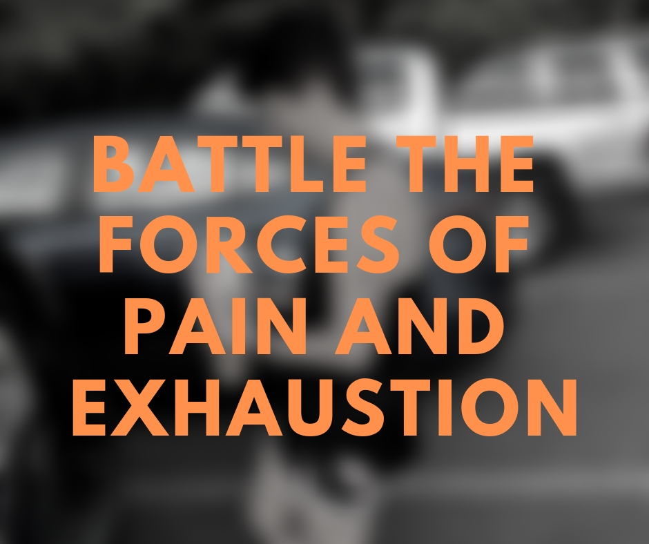

I gave myself a challenge. Run 10 miles, every day, for 7 days in a row. My highest weekly mileage of all time was 55 miles. This will be the most I have run in a week, a 27% increase (I am aware of a 10% rule for which I have no regard). Normally I don't do stuff like this. I usually am looking to get a certain time in a race. To that end, I do a combination of long runs, track workouts, tempos, and recovery runs. This is a whole different challenge. Seven, best effort, 10 mile runs in a row.

I am now finished with my fourth day of the challenge. I have already accomplished something I have never accomplished before (40 miles in 4 days). I am not injured. I have the time in my schedule blocked out. I can do this. I am tired. Very tired. The energy is drained from my body. My muscles want nothing more than to take the three-day recovery they deserve before the next onslaught. My mind is sluggish. My will is weak. I find myself asking,

Why?

Recently I was asked what The Order of Runfastus stands for. My answer was to state the truths we hold:

1. Runfastus lives.
2. Runfastus' influence is felt.
3. The highest virtue is speed.

What can we find in these truths to keep us going in times of weakness? What lines of reasoning can we construct to justify our pain? I tell you the truth, these kinds of questions are nonsensical. They reflect a fatal flaw the patterns of the thinking of this age.

The reason that I will endure is because of the influence of Runfastus. I reject modern reasoning. I do not persevere for bragging rights on Strava, nor to achieve a personal milestone. I do not persevere so that I can race faster nor is this just part of my training program. I don't persevere because I have a community of runners supporting me nor do I have a coach giving me the motivation I need.

I refuse to fill my head with the noise and distraction of reason. I need precisely the life of Runfastus to battle the forces of pain and exhaustion. That is the meaning of his living. It is enough. The life of Runfastus embodies everything I need to keep me going. Yet there is nothing that Runfastus embodies that can be directly described and analyzed.

I will let this endurance challenge be an exercise in deep meditation on Runafastus. The end will be to achieve a deeper state to capture the true spirit of running. Even this reasoning is a crutch that I shall shed when I reach the truth. Runfastus lives.
