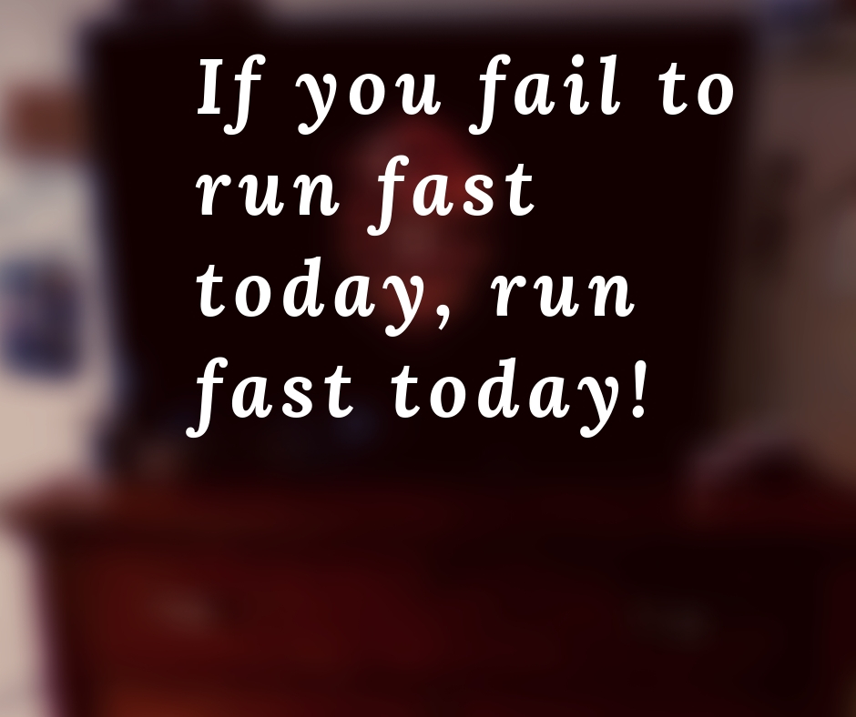

Since my latest emergence, I have been observing the world. I am finding ways to explain the message of The Order of Runfastus to the people of this age. When I'm not running fast I wander the web. In my travels, I have found the most wonderful thing. It is called "speedrunning".

Speedrunning is when you play a video game from start to finish in the fastest time possible. What an incredible name for an activity. Not "running", not "running fast", but "speedrunning". If you are not running fast, you are not doing the activity by definition. What divine beauty!

The most important priority for any runner is to run fast. That goes for the ambulatory and digital varieties of running. I have learned much about speedrunning and it includes an important element of skill and a non-trivial amount of luck. It is also supported by an archive of glitches and exploits to make the game faster than originally intended. These things are not what is so interesting about speed running. It's the speedrunners themselves.

Speedrunners are usually lonely and nameless. Perhaps they participate with a few friends. Sometimes if they're lucky, they get a following on Twitch. But for the vast majority of runners, it's just them and the game. Many people say sinking countless hours into playing the same game the same way over and over again is a waste, but not for the speedrunner. You could say the same about any runner, but hypocritically the modern runner is sickeningly revered. Oh to have a culture so pure in motivation! I lament the accolades and popular affirmation heaped on people who run marathons and 5ks and the like. How hard it is to find and nurture a true love for speed in this age! These speed runners, they have it.

Speedrunners also have an enormous amount of what I call "mental toughness". Imagine you're running a marathon, you're feeling great, and you hit a brick wall at mile 20. You're devastated. So you pick yourself back up, you console yourself, and next time you take it easier. You run slower. Speedrunners afford themselves no such wimpiness. No, if you're a speedrunner and you get burned by RNG 2 hours into a run, you slam that reset button and go again HARDER than you did before. You have no time to be a baby and whine as a speedrunner. You have frames to save!

So what can we learn from the speedrunner? We must not fall victim to the running culture around us. If you're only motivated to run because it is the popular thing to do you will never run fast. You will never grind the countless hours in training that you need to be your fastest self. Learn from the speedrunner: grinding his or her weird hobby, ignoring all reason and society. Speed is the most important thing.

We must become mentally tough. If you fail to run fast today, run fast today! Learn from the speedrunner. Don't let the fact that your body is telling you to quit, make you quit. Trying again tomorrow is not good enough. Try again today!

If you too want to be inspired by speedrunners. I recommend [Zant](https://www.twitch.tv/zant/).
