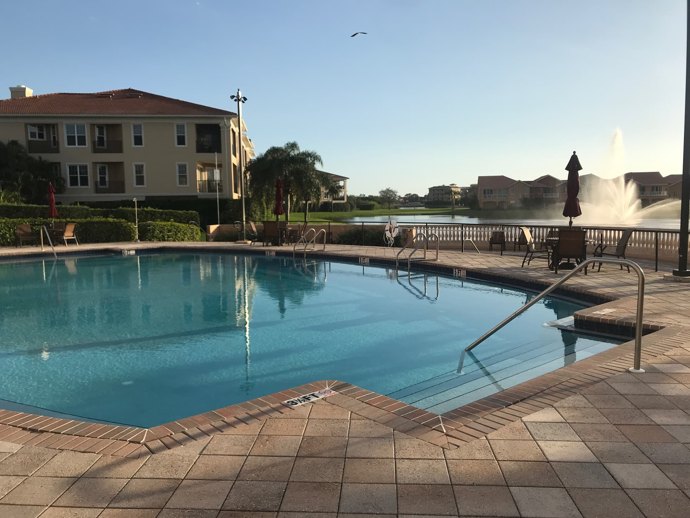

What’s a man to a mob?

What’s a mob to a king?

What’s a king to a God?

What’s a God to a non believer?

Every good lord knows they need a castle or they are no lord at all. Some take to the road, some to the ocean, some take to shelter, some the rubber… what matters most is that you take. Runfastus takes many. He takes road and path, track and field.

Recently Lord Swimmingaton has taken membership to City Sports Fitness Club. It’s not the best. Mainly because of the crowds. Ocean widths are shorter than desired. Only three lanes.

What’s a lane to a pool?

What’s a pool to an ocean?

What’s an ocean with no lord?

You could imagine the anxiety that follows when it’s 30 minutes till closing but Lin and Tammy are having gossip hour in the middle of lane three and senior citizens Paul and Cheryl are going max two laps per hour (2 LPH) in lane one, while three rogue swimmingatons are crowding lane two.

*The lord joined lane two as it was the path of least resistance.*

Some issues we cannot battle in one day. City Sports Fitness Club (my castle) is the best I can do at the moment for what I am willing to compromise. What are you willing to compromise? I would imagine it’s a lot... since you lack backbone… and I’m guessing you also lack backstroke.

The point being, you need to decide where your castle will be. What will you lord over? Maybe it’s one indoor and one outdoor. Maybe you’re too big of a coward to decide. I wish you had a backbone. Please do not come to my castle and swim.

If you do, please note member prices. Club fees are not fun. I found at best I was able to do was add onto The Most Honorable Kreastos membership as a family member for $25 initiation, $35 a month, and once you sign and pay they make sure to tell you that “annual dues” are $50 charged in April.

Find another location. Take something else. Take what’s yours.
