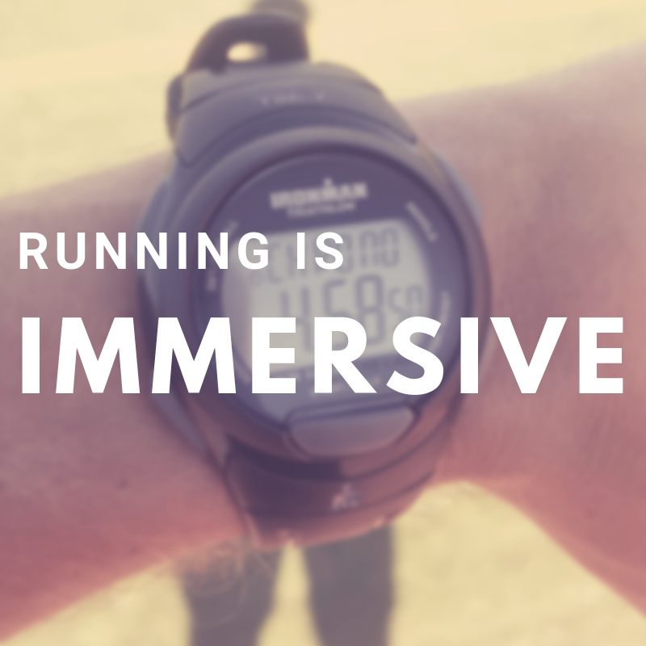

Running is a huge time commitment. It is not something, therefore, that you can do when it's convenient or when you want to. You must immerse yourself in the lifestyle of a runner especially if you want to run fast. I am not talking about the popular lifestyle of a runner, I am talking about the real and practical lifestyle of a runner.

As a baseline, I would say that the least amount of running you can do in a week is about 15-20 miles. Any less than that and you're just dabbling. You'll never make the progress you need to make to actually run fast. This can be done in "seasons" where you go into a mode of consistent running for a few months and then take a few months off. I prefer the winter months for running because of the latitude where I live.

Given this baseline, we know a few things about your life at this point. You must spend a minimum of 2 hours per week doing the actual activity of running; perhaps up to 7 hours. This is trivial. It does not account for the full picture. You must take into account the fact that you also prepare your route, prepare your clothing, stretch afterward, maybe cool down, and then clean yourself. Five activities that can easily take up an extra 30 minutes of time for every run.

The time commitments don't end there. If you're running fast, then you will be tired. When you are tired you need to sleep more. You also need to eat more. Perhaps you have a loss of productivity (although that can be balanced by some of the cognitive benefits of running). This can easily add up to significantly more time spent on running.

Then you throw an injury into the mix. Runners get injured. Each runner has a preferred way of dealing with the injury. I prefer to keep running if I can and perform a strict regiment of stretching, icing, rolling, and stimulating to recover from the injury. This takes more time. The injury is often painful too. The runner carries this pain throughout the day as a constant reminder of this part of life that isn't shared by the non-runners around. Soreness and exhaustion function this way as well.

You see, running affects not just what you do for a period of time on certain days of the week. It affects your sleep, your food, your feelings, even your very soul is touched. Running is immersive.
