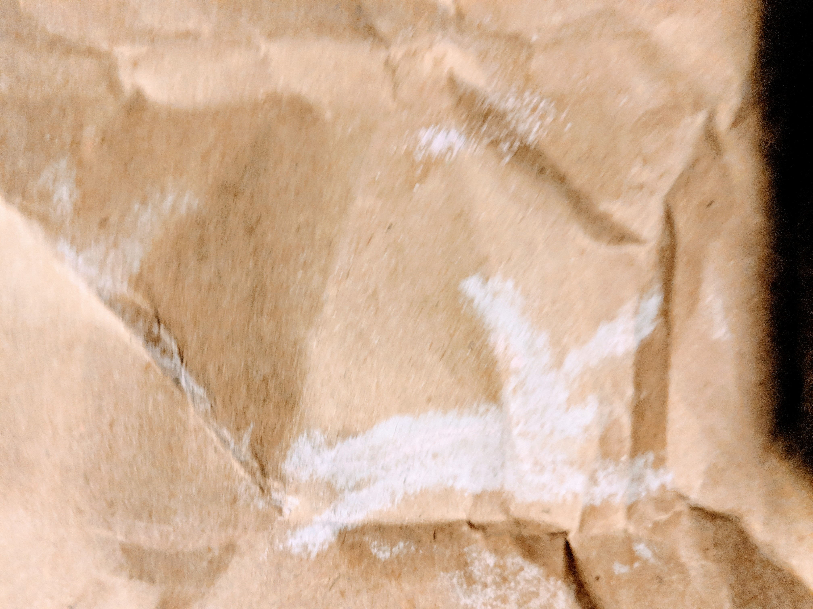

I, King Nahd, proclaim to the realm that the teachings of Dray and her glorious fore-bearer Runfastus be adopted throughout the land. Yes, indeed this proclamation shall stand forever as law. No one may reverse it. For I have come to know for certain that this Runfastus, through his messenger Dray, is sovereign over all pursuits and knows all that is to be known.

As I lay on my bed, a dream came to me. Behold a figure, a runner appeared in the land. Nobody could match him. He drew all manner of people to him. They marveled at his speed as they watched and raced. All followed him including the beasts of the field and the birds of the air. Even the plants of the ground became faster. All were united and all was at peace.

Then a loud voice echoed through the valley, though no man was seen. The voice declared, "Let the ground become slick as ice and let every eye in the land become heavy. For 26.2 times there shall be no glory, for I live. This decree cannot be altered."

And it was so. The ground became slick and the eyes became heavy. No one could wake up and anyone who tried to run moved only very slowly despite great effort. The figure at the center of it all was given the mind of a rabbit, thus fleeing and was not seen.

I awoke from my dream and called my wisest advisor to my side and related to her the dream. As Dray considered what I had told her, her face became visibly uncomfortable.

"Do not fear nor hide the dream's meaning from me," I told her.

Dray responded, "If only this dream and interpretation applied to your enemies my King! Most honorable King Nahd, you dreamed of a land of peace and prosperity, united by a figure of the utmost ability. In this dream, you are that runner of great ability. Now to its meaning. Just as the ground was turned slick and eyes turned heavy, so the glory of your rule will slip from your fingers. And just as the figure was given the mind of a rabbit, so you too will be tortured with fear of every minor sound. You will flee and not be found. I implore of you, put an end to the excesses of boasting in the realm. Then perhaps the one who lives will have mercy."

At the end of the very next season, I was circuiting the royal track and thought to myself, "I have accomplished so much by my power. Look at the lives of my subjects. They are measurably better than at any other point in history!"

Just then the temperature dropped. Rain fell and froze the earth solid. I was filled with terror at the calling of my servants and fled into the mountains where I fed on vegetables frozen to the hillside.

This lasted almost 114 weeks and when the ice melted I looked up and acknowledged the order of the one who lives is indeed the wisest and his ways most righteous. My terror was taken from me. I was found by my servants and restored to my place as King. Thus restored to my throne I said, "All honor to the fore-bearer of Dray known to us by the name Runfastus who lives. May all be free and let no man or woman impose their standard on another. Runfastus is sovereign over all pursuits and knows all that is to be known." And so the kingdom returned to peace became more prosperous than at any time previous.
